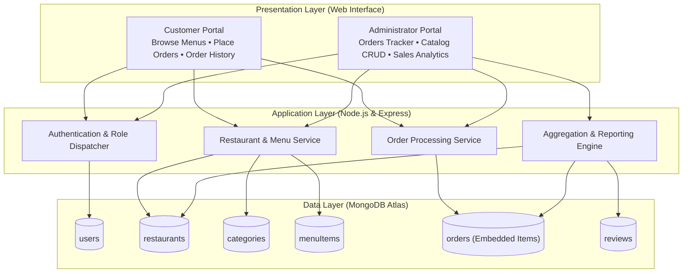
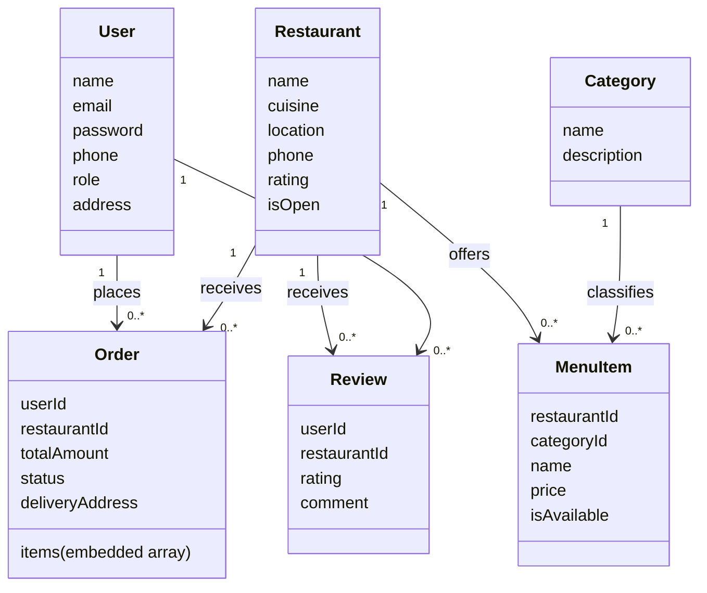

# Restaurant Ordering and Management System

A full-stack web application designed for food ordering, restaurant administration, and sales analytics, built using Node.js, Express, and MongoDB.

---

## 1. About the Project

The Restaurant Ordering and Management System provides a centralized digital platform connecting customers and restaurant managers. It eliminates manual order tracking and fragmented catalog updates by offering real-time order processing, categorized menu browsing, and automated operational analytics through a document-oriented database.

The application serves two primary user roles:
- **Customers:** Browse local restaurants, search dishes by cuisine or category, add items to cart, place orders with delivery instructions, track order status in real time, and leave ratings and reviews.
- **Administrators:** Manage restaurant profiles, maintain menu catalogs, update order fulfillment stages, and monitor live sales performance through aggregation reports.

---

## 2. System Architecture

The project follows a three-tier architecture separating presentation, business logic, and cloud database storage.



---

## 3. Data Model

The application models restaurant operations across six collections using a hybrid referencing and embedding approach:



### Design Strategy
- **Normalized References:** Collections such as `users`, `restaurants`, and `categories` are referenced by identifier to prevent redundancy and maintain centralized record updates.
- **Embedded Documents:** Ordered dishes are embedded directly inside each order record (`orders.items`). This ensures complete order details and historical prices can be retrieved in a single read without multi-table join overhead.

---

## 4. Key Features

### Customer Experience
- Multi-attribute search across restaurant name, cuisine type, and location.
- Category filtering for fast discovery (Biryani, Burgers, Pizzas, Desserts, Beverages).
- Interactive food basket with quantity controls and total price calculation.
- Live order status tracking across stages: Placed, Preparing, Out for Delivery, and Delivered.
- Customer rating and review submission with dynamic average rating updates.

### Administrative Management
- Real-time orders dashboard with inline status updating.
- Complete Create, Read, Update, and Delete (CRUD) operations for restaurants and menus.
- Overview metrics tracking total sales revenue, order volumes, and registered accounts.
- Automated analytics reporting top-selling items and revenue breakdown by restaurant.

---

## 5. Technology Stack

- **Backend:** Node.js, Express.js
- **Database:** MongoDB Atlas (Mongoose ODM)
- **Frontend:** HTML5, CSS3, JavaScript (Responsive Vanilla UI)
- **Database Features:** Aggregation Pipelines, Text Search Indexing, Compound Indexing

---

## 6. Getting Started

### Prerequisites
- Node.js installed on your machine
- npm (Node Package Manager)

### Running the Application Locally
1. Clone the repository:
   ```bash
   git clone https://github.com/sreebalasubramaniyan/DBMS.git
   cd DBMS
   ```

2. Install dependencies:
   ```bash
   npm install
   ```

3. Populate the database with sample data:
   ```bash
   npm run seed
   ```

4. Start the server:
   ```bash
   npm start
   ```

5. Open your web browser and visit:
   ```
   http://localhost:3000
   ```

---

## 7. Default Demonstration Credentials

| Role | Email Address | Password |
| :--- | :--- | :--- |
| Customer Portal | `sree@vit.ac.in` | `password123` |
| Administrator Portal | `admin@restaurant.com` | `adminpassword` |
