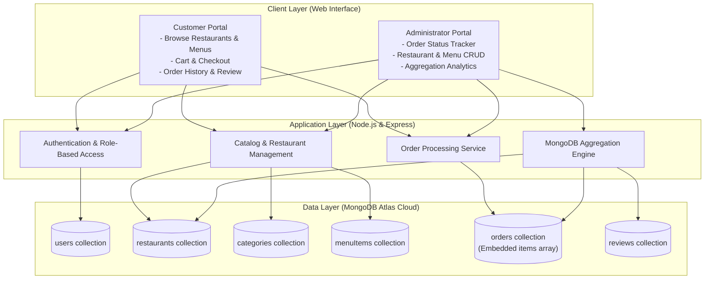
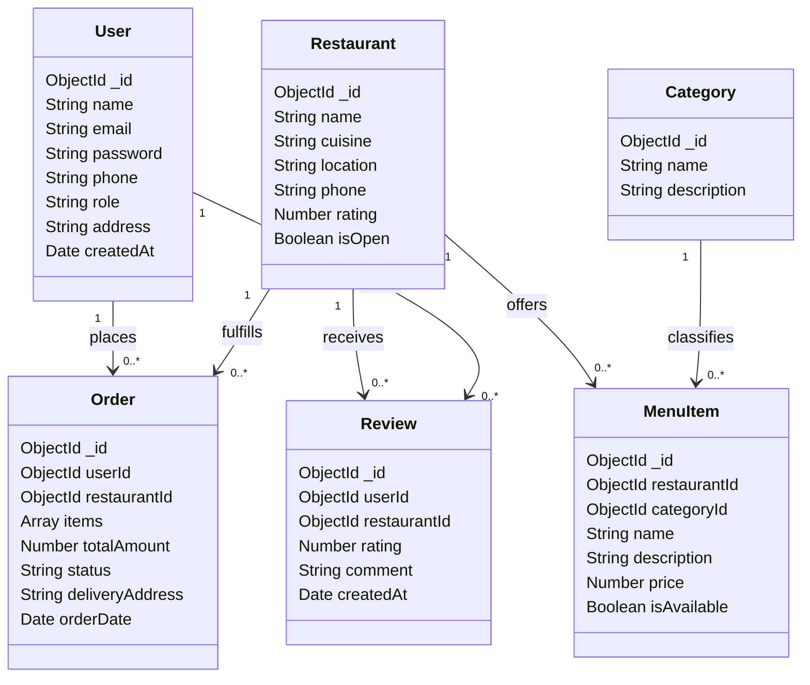

# Restaurant Ordering and Management System

**Academic Course:** Database Management Systems (DBMS Lab Project)  
**Author:** Sree Balasubramaniyan  
**Registration Number:** 24BKT0162  
**Institution:** Vellore Institute of Technology (VIT), Vellore  
**Database Technology:** MongoDB (Document-Oriented NoSQL Database)  

---

## 1. Project Overview

The Restaurant Ordering and Management System is a centralized web-based platform designed to streamline food ordering, restaurant administration, and sales analytics. Traditional restaurant workflows rely on disparate or manual processes that struggle to scale when customer volume, menu items, and order frequency increase. This application addresses these challenges by offering a modern, document-oriented NoSQL solution using MongoDB.

The system features two dedicated interfaces:
1. **Customer Portal:** Enables users to browse registered restaurants, filter by culinary categories, customize orders, track live order fulfillment, and submit dining reviews.
2. **Administrator Portal:** Provides restaurant managers with tools to oversee restaurant profiles, modify menu catalogs, track order statuses in real time, and analyze sales performance through multi-stage aggregation pipelines.

---

## 2. System Architecture

The application adopts a three-tier client-server architecture built on Node.js, Express, and MongoDB Atlas.



---

## 3. Data Model and Schema Design

The database design maps the relational entities of a restaurant ecosystem into six distinct MongoDB collections using a hybrid referencing and embedding approach.



### Relationship Design Justification
- **Referencing (Normalized Data):** Primary entities (`users`, `restaurants`, `categories`) maintain standalone collections referenced by `ObjectId`. This avoids data duplication and ensures consistent updates across restaurants and menus.
- **Embedding (Denormalized Data):** The line items inside each order are embedded directly within `orders.items[]`. Because order line items are always retrieved in conjunction with the parent invoice, embedding guarantees atomic single-document reads without requiring join operations. It also preserves historical pricing if a dish price is altered in the catalog later.

---

## 4. Key Functional Modules

### User and Role Management
- Provides secure credential-based access control.
- Automatically directs authenticated users to their corresponding dashboard based on their registered role (`customer` or `admin`).

### Customer Ordering Workflow
1. **Discovery:** Customers search restaurants by name, cuisine, or geographical location, assisted by database text indexing.
2. **Catalog Browsing:** Filter menu items by categories such as Biryani, Beverages, Desserts, Burgers, or Pizzas.
3. **Cart and Checkout:** Dynamic basket calculations compute line items and total amounts.
4. **Order Tracking:** Real-time visibility into order status through chronological stages: Placed, Preparing, Out for Delivery, and Delivered.
5. **Customer Feedback:** Verified customers can submit ratings and reviews, which dynamically update restaurant averages.

### Administrative Management and Operations
1. **Order Fulfillment:** Managers track live order feeds and update dispatch statuses sequentially.
2. **Catalog Administration:** Complete Create, Read, Update, and Delete capabilities for restaurant listings, category definitions, and individual menu items.
3. **User Auditing:** Centralized view of registered customer records and contact information.

---

## 5. Advanced NoSQL Features

### Aggregation Pipelines for Business Intelligence
The system leverages MongoDB aggregation pipelines to compute operational metrics dynamically:
- **Revenue and Volume by Restaurant:** Aggregates non-cancelled orders by restaurant identifier, calculating total revenue, transaction counts, and average order values, enriched with restaurant profile lookups.
- **Top Best-Selling Dishes:** Utilizes the `$unwind` stage to deconstruct the embedded items array, grouping by dish name to identify top sellers by cumulative volume and revenue.
- **Order Status Distribution:** Analyzes order fulfillment stages across all restaurants to monitor kitchen and delivery efficiency.
- **Dynamic Restaurant Ratings:** Computes live average ratings from customer feedback stored in the reviews collection.

### Database Indexing Strategy
To maintain low latency as the document store expands, specialized indexes are implemented:
- **Text Index:** Configured on the `restaurants` collection across `name`, `cuisine`, and `location` to support instant multi-field keyword searching.
- **Compound Indexes:** Configured on `menuItems` (`restaurantId`, `categoryId`, `isAvailable`) and `orders` (`userId`, `orderDate`) to eliminate full collection scans and ensure efficient sorting.

---

## 6. Project Setup and Execution

### Prerequisites
- Node.js (version 18 or higher)
- npm (Node Package Manager)
- Active internet connection for MongoDB Atlas access

### Installation
1. Clone the repository:
   ```bash
   git clone https://github.com/sreebalasubramaniyan/DBMS.git
   cd DBMS
   ```

2. Install dependencies:
   ```bash
   npm install
   ```

3. Environment configuration:
   The application uses environment variables defined in `.env` for database connection credentials and port specification.

4. Populate sample dataset:
   ```bash
   npm run seed
   ```
   This loads 67 realistic sample documents across all six collections.

5. Start the application:
   ```bash
   npm start
   ```

6. Access the web interface:
   Open a web browser and navigate to:
   ```
   http://localhost:3000
   ```

---

## 7. Default Demonstration Credentials

| Account Type | Email Address | Password | Role Description |
| :--- | :--- | :--- | :--- |
| Customer Account | `sree@vit.ac.in` | `password123` | End-user account with ordering, tracking, and review permissions. |
| Customer Account (Secondary) | `arun@example.com` | `password123` | Secondary customer account for multi-user demonstration. |
| Administrator Account | `admin@restaurant.com` | `adminpassword` | Managerial account with full CRUD access and analytics access. |

---

## 8. Academic Review Alignment

This implementation fulfills all criteria specified in the academic evaluation rubrics:
- **Review 1:** Problem formulation, requirement specification, entity-relationship mapping, and 6-collection schema architecture.
- **Review 2 (10 Marks):** Database implementation on MongoDB Atlas with 67 sample documents (exceeding the 50 record requirement), complete CRUD workflows across dual dashboards, and advanced NoSQL features including multi-stage aggregation pipelines and indexing strategies.
